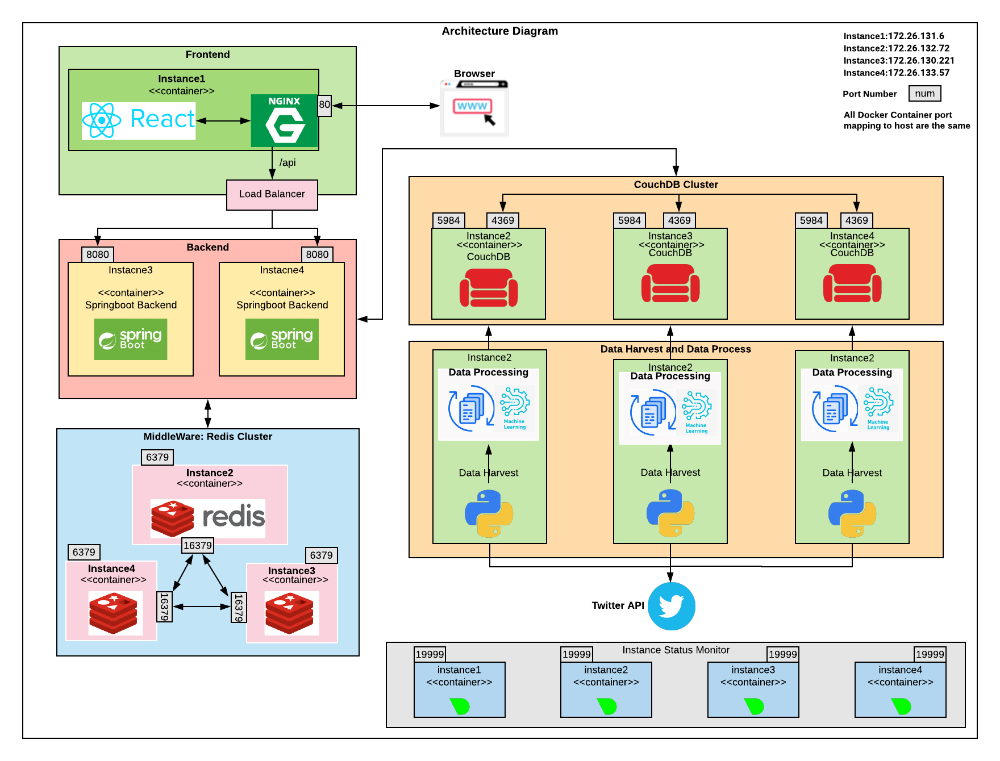
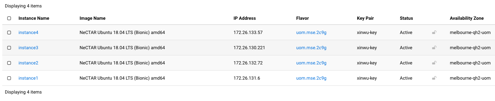
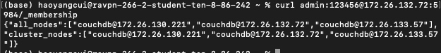
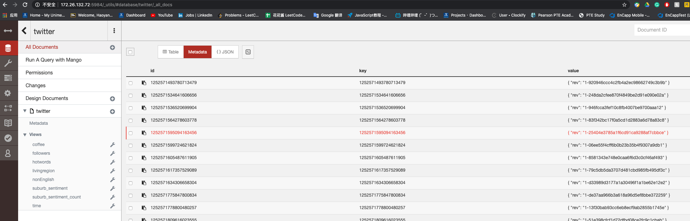
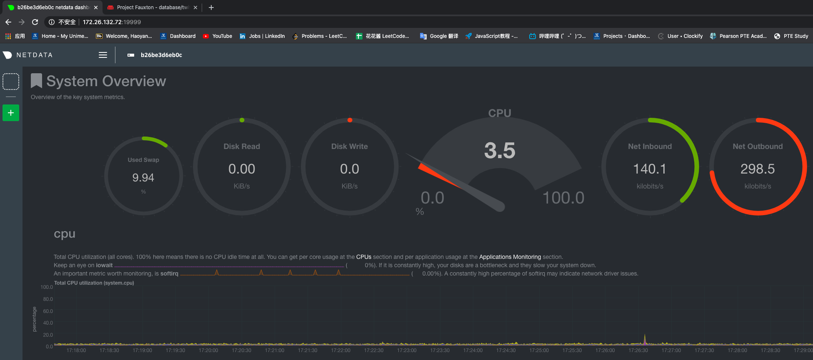

# CCCProject2  

## Team Members:
Haoyang Cui - haoyangc@student.unimelb.edu.au

Xin Wu - wux14@student.unimelb.edu.au

Dongming Li - dongming@student.unimelb.edu.au

ZIYUE WANG - ziyue2@student.unimelb.edu.au

Mayan Agarwal - mayana@student.unimelb.edu.au

## Videos and Documentation
**Youtube link**:

System Architecture Design: https://m.youtube.com/watch?v=utQ9gJSVDyY&feature=youtu.be

Ansible: https://m.youtube.com/watch?v=9sFTue2hmU8&feature=youtu.be

Scenarios Demo: https://m.youtube.com/watch?v=8ljMIrDm5lw&feature=youtu.be

**Slides**: [slides](documents/slides)

## System Architecture



### Explanation:

### Data Harvest&Processing
Data harvester collects data from Twitter API(both Search API and Stream API) and processor will further complete sentiment analysing using NLP library and Geo info recognising.

### CouchDB Cluster
Handled data will be written into CouchDB cluster with MapReduce views, backend could request relevant data from different views. We clustered three different instances as one couchDB cluster. In our test, the DB read/write performances are improved a lot through clustering.


### Middleware Redis Cluster
Lots of query requests are repeated and CouchDB responds to the same data, which let CouchDB do the same query and waste computing resources. Redis is an in-memory database and the speed is overwhelming. Middleware redis cluster can help couchDB Reduce the burden and improve response speed.


### Backend
Nginx will assign requests for a specific backend by loading balance strategy. When a backend gets a request, it will validate the request first and process the request if it is legal, abandon it if it is illegal. Backend query redis first and if the target data in redis then quickly response to nginx and nginx sends the data to the browser. If target data is not in redis, then query couchDB and response the data besides, store the data into redis in case next time query.


### Frontend & Nginx:
We use Nginx as a HTTP server and store those frontend static resources to provide frontend functionalities. The Nginx server listens to port 80 to handle requests from the browser(client). Nginx will pass all backend requests starting with /api/ to one of those two upstream backend servers by the configuration of proxy_pass and use Round Robin load balance policy to assign which backend processes the request.
We use React to build up our frontend as a single page application(SPA), so to provide routing between components, we use BrowserRouter to parse the url. And to avoid the hassle caused by unnecessary pass state and data through intermediary components, we use React Context to provide a central and global store.

### Instance Status Monitor:
We deployed netData for monitoring instance status on all instances, including usage of CPUs, Disk and network. This could give us clear views about any issue on Server, and provide an efficient visualisation of workload in our system


## Ansible Playbook Deployment

### openstack key

```
MTFjM2E4MWE3Mjk3NGVi
```

### step 1 create VMs
```
./create_VMs.sh
```
Sub-steps inside:
* create volumes
* set security-group
* create instances

After created, we can get four instances:




### step 2 set VMs environment
```
./set_environment.sh
```
Sub-steps inside:
* set-proxy
* mount-volumes
* install-docker

### step 3 cluster CouchDB
```
./couchdb_cluster.sh
```
Three nodes will be configured as a couchDB cluster, the membership could be checked by executing the commend:
```
curl admin:123456@172.26.132.72:5984/_membership
```
and the result will look like below:



Instance2, instance3 and instance4 have be successfully clustered.

### step 4 Deploy all applications and components
```
./DeployAllApplications.sh
```
SUb-steps includes:
* deploy netData component for server status monitoring
* Set Map Reduce and Data harvest
* Set Redis cluster as Middleware
* Deploy springboot backend
* Deploy frontend together with nginx configuring

After this step, all required components should be successfully deployed, they may look like below:

couchDB:


web:


Server Status Monitor:



## All Instacnes Arrangement

Instance1: 172.26.131.6
* frontend
* nginx
* Server Status Monitor
* grafana

Instacne2: 172.26.132.72
* CouchDB Cluster (masternode)
* Redis
* Data Harvester
* Server Status Monitor

Instance3: 172.26.130.221
* Backend1
* CouchDB Cluster (subnode1)
* Redis
* Data Harvester
* Server Status Monitor

Instance4: 172.26.133.57
* Backend2
* CouchDB Cluster (subnode2)
* Redis
* Data Harvester
* Server Status Monitor
